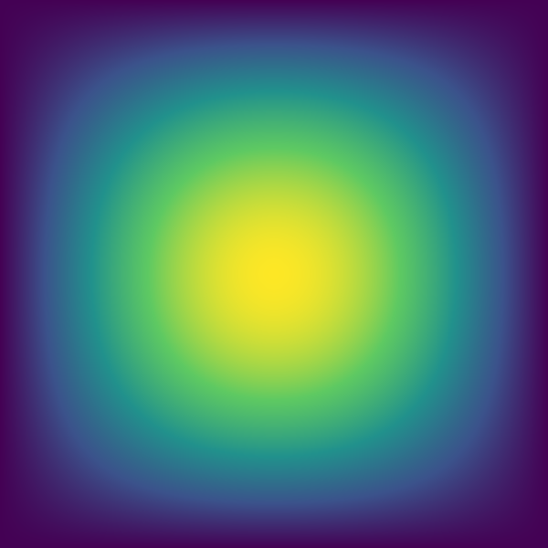

# femheat

[](https://github.com/thefcan/femheat/actions/workflows/ci.yml)

A from-scratch **2D finite element method (FEM) solver** for steady-state heat
conduction, written in modern C++17 and validated with the Method of
Manufactured Solutions.

<p align="center">
  
  <br/>
  <em>Temperature field from <code>femheat --case mms2d</code> on the unit square
  (real solver output, rendered from the exported node values).</em>
</p>

## What it solves

femheat solves the steady-state heat equation

```
-div(k grad T) = f      on a domain Ω,
```

with Dirichlet (`T = g`) and Neumann (prescribed flux) boundary conditions, in
both 1D and 2D.

## How it works

By the Galerkin finite element method: multiplying the PDE by a test function
and integrating by parts gives the **weak form**

```
∫_Ω k ∇T · ∇v dΩ  =  ∫_Ω f v dΩ  +  (boundary flux terms).
```

The temperature is approximated by **piecewise-linear shape functions** on a mesh
of elements — 2-node segments (`Line2`) in 1D, 3-node triangles (`Tri3`) in 2D —
which turns the weak form into a sparse **symmetric positive-definite** system
`K T = f`. Dirichlet conditions are imposed with a penalty term; Neumann
conditions enter naturally through the boundary integral. The system is solved
with a Jacobi-preconditioned **conjugate gradient** iteration (Eigen).

Because the elements are linear, the discretization is **second-order accurate**:
halving the mesh size cuts the L2 error by ≈ 4×. We confirm this with the Method
of Manufactured Solutions (MMS) — pick an exact `u`, derive the source `f` it
implies, solve, and measure the observed convergence order (see below).

## Architecture

```
                          ┌──────────────┐
        mesh + material   │  HeatProblem │   orchestration  (solve())
        + source + BCs    └──────┬───────┘
                                 │
   Mesh1D / TriMesh  ──build──►  IElement  ◄── Material (k)
     (geometry)                 Line2 / Tri3
                                 │  elementStiffness() / elementLoad()
                                 ▼
                           ┌───────────┐        IBoundaryCondition
                           │ Assembler │ ◄────  DirichletBC (penalty)
                           └─────┬─────┘        NeumannBC   (flux)
                    sparse K, f  │
                                 ▼
                          ┌──────────────┐
                          │ LinearSolver │   Eigen ConjugateGradient (SPD)
                          └──────┬───────┘
                       nodal T   │
                                 ▼
                          ┌──────────────┐
                          │  Hdf5Writer  │ → result.h5 + result.xdmf (ParaView)
                          └──────────────┘
```

- `IElement` is an abstract element interface (runtime **polymorphism**), so the
  same `Assembler` serves both 1D and 2D.
- `IBoundaryCondition` is a **strategy** interface (`DirichletBC`, `NeumannBC`).

## Tech stack

| Concern         | Tool                                                                  |
| --------------- | --------------------------------------------------------------------- |
| Language / build | C++17, CMake (≥ 3.16)                                                 |
| Linear algebra  | [Eigen 3](https://eigen.tuxfamily.org) — sparse matrices + CG          |
| File I/O        | [HDF5](https://www.hdfgroup.org/) via [HighFive](https://github.com/BlueBrain/HighFive), with a companion XDMF |
| CLI             | [Boost.Program_options](https://www.boost.org/)                       |
| Testing         | GoogleTest + CTest                                                     |
| CI              | GitHub Actions (ubuntu-latest)                                         |

Eigen, HighFive and GoogleTest are fetched automatically via CMake
`FetchContent`; HDF5 and Boost are located with `find_package`.

## Build & test

### Linux (Ubuntu)

```bash
sudo apt-get update
sudo apt-get install -y build-essential cmake libhdf5-dev libboost-program-options-dev
cmake -B build -DCMAKE_BUILD_TYPE=Release
cmake --build build
ctest --test-dir build --output-on-failure
```

### macOS

```bash
brew install cmake hdf5 boost
cmake -B build -DCMAKE_BUILD_TYPE=Release
cmake --build build
ctest --test-dir build --output-on-failure
```

A fresh clone builds with just `cmake -B build && cmake --build build`.

## Running the solver

```bash
# 2D manufactured solution on the unit square -> HDF5 + XDMF for ParaView
./build/femheat --case mms2d --nx 40 --ny 40 --k 1.0 --out result.h5

# 1D manufactured solution, reports its L2 error
./build/femheat --case mms1d --nx 80 --k 1.0

# options
./build/femheat --help
```

Open `result.xdmf` in [ParaView](https://www.paraview.org/) to visualize the
temperature field. The optional `--csv field.csv` flag also dumps the node
values, which `scripts/plot_field.py` renders to a PNG with **no third-party
Python packages** required:

```bash
./build/femheat --case mms2d --nx 81 --ny 81 --csv field.csv --out result.h5
python3 scripts/plot_field.py field.csv 81 81 docs/temperature_field.png
```

## Validation — convergence study

Both solvers are validated with MMS. The observed order is

```
p = log(err_coarse / err_fine) / log(h_coarse / h_fine),
```

and the regression tests assert `p ∈ [1.7, 2.3]`. The numbers below are the
actual output of the test suite.

**1D**, `u(x) = sin(pi x)`:

| elements `n` | L2 error    | observed order |
| -----------: | ----------- | -------------: |
|           10 | 9.0855e-03  |        —       |
|           20 | 2.2747e-03  |      1.998     |
|           40 | 5.6887e-04  |      1.999     |
|           80 | 1.4223e-04  |      2.000     |

**2D**, `u(x, y) = sin(pi x) sin(pi y)`:

| nodes / side | L2 error    | observed order |
| -----------: | ----------- | -------------: |
|           11 | 1.5778e-02  |        —       |
|           21 | 3.9913e-03  |      1.983     |
|           41 | 1.0008e-03  |      1.996     |

The error drops by ≈ 4× per refinement and the order approaches 2, exactly as
theory predicts for linear elements. ✅

## Project layout

```
femheat/
├─ include/femheat/   public headers (Mesh, IElement, Assembler, ... )
├─ src/               library implementation  -> femheat_lib
├─ apps/femheat.cpp   CLI executable          -> femheat
├─ tests/             GoogleTest unit + regression tests -> femheat_tests
├─ scripts/           stdlib-only field plotter
└─ docs/              figures
```

## Roadmap

- [x] **M0** — Skeleton & toolchain (CMake, dependencies, CI, smoke tests)
- [x] **M1** — 1D FEM core (`Line2`, assembly, Dirichlet BC, Eigen solve)
- [x] **M2** — 1D MMS validation + convergence study; Neumann BC
- [x] **M3** — 2D linear triangles (`Tri3`) + 2D MMS validation
- [x] **M4** — HDF5/XDMF output + Boost.Program_options CLI
- [x] **M5** — Docs, real convergence tables, field figure, `v0.1`

## License

[MIT](LICENSE) © 2026 Furkan Karafil
